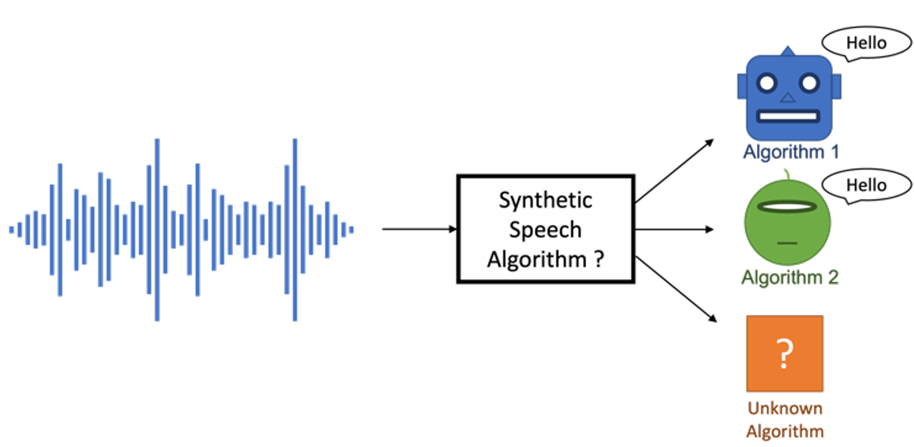

# SPCUP2022: Speech Spoof Detection Challenge

The **SPCUP2022 Speech Spoof Detection Challenge**, part of the IEEE Signal Processing Cup, focused on **Synthetic Speech Attribution**. Participants were tasked with designing systems capable of identifying the specific synthesis method used to generate synthetic speech. The challenge also involved detecting speech generated by unknown synthesis algorithms, a critical task in ensuring the robustness of speech-based technologies.

---

## 🔍 Challenge Overview

The primary objective of this challenge was to classify synthetic speech into:
1. Known algorithms (e.g., Algorithm 1, Algorithm 2).
2. Unknown algorithms, requiring systems to generalize beyond the training data.

The figure below illustrates the problem setup, where a system receives an input audio waveform and predicts the synthesis method or detects it as an unknown source:

---

## 📂 Dataset

The dataset for this challenge can be accessed at the following link:  
[SPCUP2022 Dataset](https://doi.org/10.34740/kaggle/dsv/2866458)

---

## 📊 Results

Our method achieved **4th place** in the SPCUP2022 challenge, demonstrating robust performance in both clean and noisy conditions:
- **Part 1 (Clean Data)**: Achieved **96.5% accuracy** on the evaluation set.
- **Part 2 (Noisy Data)**: Achieved **95.5% accuracy** under noisy and distorted conditions.
- 

## 📄 Detailed Report
For more detailed information about the dataset, approach, and results, refer to the official report included in this repository:  
[SPCUP2022 Report (PDF)](2022_SPCUP_report.pdf)

---

## References

1. **Official Challenge Page**:  
   [IEEE SPCUP2022](https://signalprocessingsociety.org/community-involvement/ieee-signal-processing-cup-2022)  
   - Provides official details about the challenge, including objectives, dataset composition, evaluation criteria, and participation guidelines.

2. **Paper**:  
   [Syn-Att: Synthetic Speech Attribution via Semi-Supervised Unknown Multi-Class Ensemble of CNNs](https://arxiv.org/abs/2309.08146)  
   - Describes a CNN-based approach combined with semi-supervised learning techniques for synthetic speech classification, specifically tailored for SPCUP2022.
